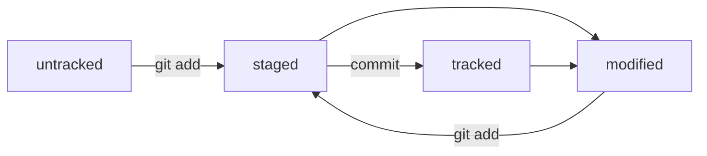

# ASSIGNMENT
ASSIGNMENT FOR THE VERSION CONTROL CLASS

В этом проекте собрана информация из курса "контроль версий"

### 1 Статусы файлов в git

```mermaid
graph LR;
    untracked -- "git add" --> staged
    staged -- "commit" --> tracked
    staged --> modified
    tracked --> modified
    modified -- "git add" --> staged
```
